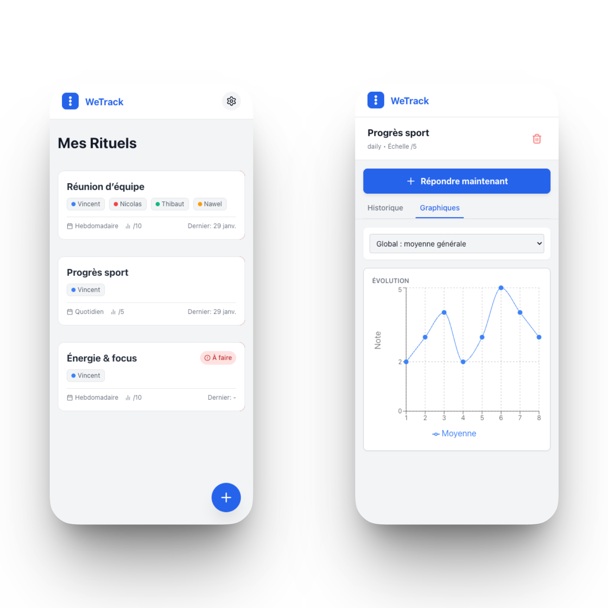

<div align="center">
  

  <h3>WeTrack</h3>
  <p>A privacy-focused, offline-first PWA for tracking personal and shared rituals through recurring questionnaires and visual analytics.</p>
</div>

<br />

<div align="center">
  
</div>

<br />

## ✨ Core Features

*   **Offline-First Architecture**: Built on IndexedDB, ensuring complete functionality without an internet connection. Your data never leaves your device unless you export it.
*   **Customizable Rituals**: Create tailored questionnaires with specific participants, frequencies (daily, weekly, monthly), and scoring scales.
*   **Visual Analytics**: Analyze trends over time with 4 distinct chart modes, including per-person evolution and global averages.
*   **Data Sovereignty**: Full control over your data with robust JSON export and import capabilities (including intelligent merging).
*   **PWA Optimized**: Installable on iOS and Android with a native-like feel, touch-friendly wizard, and cached assets.

<br />

## 🛠️ Tech Stack

*   **Framework**: [Next.js 16](https://nextjs.org/) (App Router)
*   **Language**: [TypeScript](https://www.typescriptlang.org/)
*   **Styling**: [Tailwind CSS 4](https://tailwindcss.com/)
*   **State Management**: [Zustand](https://github.com/pmndrs/zustand)
*   **Persistence**: [IndexedDB](https://developer.mozilla.org/en-US/docs/Web/API/IndexedDB_API) (Native Wrapper)
*   **Visualization**: [Recharts](https://recharts.org/)

<br />

## 🚀 Getting Started

Follow these steps to get the project running on your local machine in minutes.

### Prerequisites

*   **Node.js** (v18 or higher): [Download Node.js](https://nodejs.org/)
*   **npm** (comes with Node.js)

### 1. Installation

Clone the repository and install dependencies:

```bash
git clone https://github.com/your-username/wetrack.git
cd wetrack
npm install
```

### 2. Environment Variables

This project is a client-side PWA relying on IndexedDB. It does not strictly require environment variables for local development.

However, if you plan to integrate specific features later, create a `.env.local` file:

```bash
touch .env.local
```

**⚠️ Important:** Never commit your `.env.local` file to version control.

### 3. Run the Development Server

Start the application in development mode:

```bash
npm run dev
```

Open [http://localhost:3000](http://localhost:3000) in your browser to start tracking your rituals.

<br />

## ⚙️ Architecture

This project follows a **Feature-Based Architecture** combined with **Next.js App Router**:

*   **`/features`**: Contains domain-specific logic (components, hooks) grouped by feature (e.g., `rituals`, `charts`, `wizard`).
*   **`/lib/db`**: A lightweight wrapper around the native IndexedDB API, serving as the single source of truth for all persistent data.
*   **`/store`**: Zustand stores that sync with IndexedDB to manage application state and UI logic.

<br />

## 📄 License

Distributed under the MIT License. See `LICENSE` for more information.